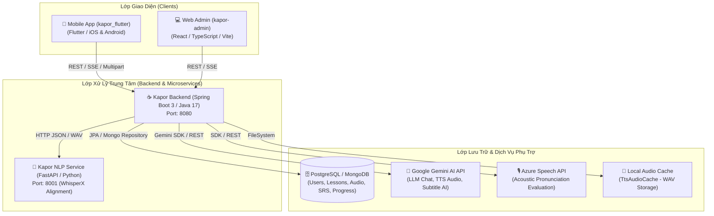

# BÁO CÁO RÀ SOÁT HỆ THỐNG VÀ TÀI LIỆU CHỨC NĂNG / WORKFLOW DỰ ÁN KAPOR

> **Thời gian thực hiện rà soát**: 02/08/2026  
> **Phạm vi rà soát**: Toàn bộ codebase dự án bao gồm Client Mobile (`kapor_flutter`), Web Admin (`kapor-admin`), Backend REST API (`kapor-backend`), NLP Service (`kapor-nlp`), Cơ sở dữ liệu và Dịch vụ phụ trợ.

---

## 📌 1. TIÊU CHUẨN ĐÁNH GIÁ CHỨC NĂNG / WORKFLOW
Dựa trên yêu cầu kiểm tra toàn diện codebase:
- **Chức năng / Workflow đã triển khai**: Là các tính năng có **chuỗi sử dụng hoàn chỉnh (End-to-End)** từ Giao diện (Flutter Mobile App / React Admin Web) hoặc Tác vụ hệ thống (Cron / Background Job) $\rightarrow$ API / Service $\rightarrow$ Lưu trữ Cơ sở dữ liệu / Dịch vụ phụ trợ (PostgreSQL/MongoDB, Gemini AI, NLP Service, Azure Speech, Audio Cache).
- **Thành phần không tính là workflow đã triển khai**: Các API Endpoint đứng riêng lẻ không có nơi gọi, file test độc lập, cấu hình Docker override chưa sử dụng, hoặc các class model nằm ngoài luồng thực thi chính.

---

## 🏗️ 2. TỔNG QUAN KIẾN TRÚC HỆ THỐNG KAPOR

---

## 🚀 3. DANH SÁCH CÁC CHỨC NĂNG / WORKFLOW ĐÃ TRIỂN KHAI HOÀN CHỈNH (END-TO-END)

### 🔑 Workflow 1: Xác thực & Quản lý Tài khoản (Auth & User Profile)
* **Mô tả**: Hỗ trợ người dùng đăng ký, đăng nhập bằng Email/Mật khẩu hoặc Google OAuth2, làm mới JWT Token tự động, khôi phục mật khẩu qua Email OTP, thiết lập Onboarding ban đầu (chọn chuyên ngành/mục tiêu) và chỉnh sửa hồ sơ cá nhân.
* **Chuỗi gọi hoàn chỉnh (End-to-End)**:
  1. **Giao diện**:
     - Mobile: [login_screen.dart](file:///Users/quachgiabao/Kapor/kapor_flutter/lib/features/auth/login_screen.dart), [register_screen.dart](file:///Users/quachgiabao/Kapor/kapor_flutter/lib/features/auth/register_screen.dart), [forgot_password_screen.dart](file:///Users/quachgiabao/Kapor/kapor_flutter/lib/features/auth/forgot_password_screen.dart), [onboarding_screen.dart](file:///Users/quachgiabao/Kapor/kapor_flutter/lib/features/onboarding/onboarding_screen.dart), [profile_screen.dart](file:///Users/quachgiabao/Kapor/kapor_flutter/lib/features/profile/profile_screen.dart)
     - Web Admin: [Login.tsx](file:///Users/quachgiabao/Kapor/kapor-admin/src/pages/Login.tsx)
  2. **Service Client**: `auth_service.dart`, `api_client.dart` (Flutter Interceptor refresh token), `api.ts` (Admin fetchWithAuth).
  3. **Backend API**:
     - `POST /api/auth/login`
     - `POST /api/auth/register`
     - `POST /api/auth/google`
     - `POST /api/auth/refresh`
     - `POST /api/auth/forgot-password`
     - `POST /api/auth/reset-password`
     - `GET /api/users/me`
     - `PUT /api/users/me`
     - `PUT /api/users/me/onboarding`
  4. **Nơi xử lý & Lưu trữ**: [AuthController.java](file:///Users/quachgiabao/Kapor/kapor-backend/src/main/java/com/kapor/auth/controller/AuthController.java), [UserController.java](file:///Users/quachgiabao/Kapor/kapor-backend/src/main/java/com/kapor/user/controller/UserController.java), `AuthService`, `UserService`, Bảng dữ liệu `users` (`User.java`), dịch vụ Email gửi OTP.

---

### 📚 Workflow 2: Học Từ vựng & Cây Kỹ năng Kỹ thuật (DevVocab - Skill Tree, Lessons, Flashcards & Games)
* **Mô tả**: Học viên mở Cây kỹ năng (Skill Tree) theo miền kiến thức (Frontend, Backend, DevOps, Data,...), theo dõi trạng thái khóa/mở các node học, học nội dung bài học, luyện tập flashcard từ vựng chuyên ngành, thực hiện bài Quiz trắc nghiệm, tham gia Trò chơi Nối từ (Matching Game), tự động tích lũy điểm XP và lưu tiến độ.
* **Chuỗi gọi hoàn chỉnh (End-to-End)**:
  1. **Giao diện**:
     - Mobile: [devvocab_screen.dart](file:///Users/quachgiabao/Kapor/kapor_flutter/lib/features/devvocab/devvocab_screen.dart), [devvocab_lesson_screen.dart](file:///Users/quachgiabao/Kapor/kapor_flutter/lib/features/devvocab/devvocab_lesson_screen.dart), [devvocab_lesson_detail_screen.dart](file:///Users/quachgiabao/Kapor/kapor_flutter/lib/features/devvocab/devvocab_lesson_detail_screen.dart), [lesson_study_screen.dart](file:///Users/quachgiabao/Kapor/kapor_flutter/lib/features/devvocab/lesson_study_screen.dart), [flashcard_study_screen.dart](file:///Users/quachgiabao/Kapor/kapor_flutter/lib/features/devvocab/flashcard_study_screen.dart), [lesson_quiz_screen.dart](file:///Users/quachgiabao/Kapor/kapor_flutter/lib/features/devvocab/lesson_quiz_screen.dart), [lesson_matching_screen.dart](file:///Users/quachgiabao/Kapor/kapor_flutter/lib/features/devvocab/lesson_matching_screen.dart).
  2. **Service Client**: [devvocab_service.dart](file:///Users/quachgiabao/Kapor/kapor_flutter/lib/features/devvocab/data/devvocab_service.dart).
  3. **Backend API**:
     - `GET /api/topics?domain={domain}`
     - `GET /api/lessons?topicId={topicId}`
     - `GET /api/lessons/{id}`
     - `GET /api/lessons/{id}/flashcards/progress`
     - `PUT /api/lessons/{id}/flashcards/{vocabularyId}`
     - `POST /api/lessons/{id}/study/complete`
     - `POST /api/lessons/{id}/quiz/attempts`
     - `POST /api/lessons/{id}/matching/attempts`
  4. **Nơi xử lý & Lưu trữ**: [TopicController.java](file:///Users/quachgiabao/Kapor/kapor-backend/src/main/java/com/kapor/devvocab/controller/TopicController.java), [LessonController.java](file:///Users/quachgiabao/Kapor/kapor-backend/src/main/java/com/kapor/devvocab/controller/LessonController.java), `SkillTreeService`, `FlashcardProgressService`, `LessonActivityProgressService`, `ActivityTrackingService`, Bảng lưu trữ `topics`, `lessons`, `flashcard_progress`, `lesson_activity_progress`.

---

### 🧠 Workflow 3: Ôn tập Từ vựng Cá nhân hóa theo Thuật toán SRS (Membyte - Spaced Repetition System)
* **Mô tả**: Cho phép học viên lưu từ vựng yêu thích từ DevVocab hoặc từ phụ đề Video vào bộ thẻ cá nhân Membyte. Thống kê số thẻ cần ôn theo ngày, xem danh sách bộ thẻ (Decks), luyện tập phản xạ flashcard với thuật toán FSRS (Free Spaced Repetition Scheduler - các nút đánh giá *Again, Hard, Good, Easy*). Hệ thống tự động tính toán khoảng thời gian lặp lại (Interval) và độ ổn định ghi nhớ (Stability).
* **Chuỗi gọi hoàn chỉnh (End-to-End)**:
  1. **Giao diện**:
     - Mobile: [membyte_screen.dart](file:///Users/quachgiabao/Kapor/kapor_flutter/lib/features/membyte/membyte_screen.dart), [membyte_review_screen.dart](file:///Users/quachgiabao/Kapor/kapor_flutter/lib/features/membyte/membyte_review_screen.dart), [vocabulary_flip_card.dart](file:///Users/quachgiabao/Kapor/kapor_flutter/lib/features/devvocab/widgets/vocabulary_flip_card.dart).
  2. **Service Client**: [membyte_service.dart](file:///Users/quachgiabao/Kapor/kapor_flutter/lib/features/membyte/data/membyte_service.dart).
  3. **Backend API**:
     - `POST /api/membyte/lessons/{lessonId}/flashcards/{vocabularyId}`
     - `POST /api/membyte/videos/{videoId}/flashcards`
     - `GET /api/membyte/lessons/{lessonId}/saved-flashcards`
     - `GET /api/membyte/decks`
     - `GET /api/membyte/review/summary`
     - `GET /api/membyte/review/cards`
     - `POST /api/membyte/review/rate`
  4. **Nơi xử lý & Lưu trữ**: [MembyteController.java](file:///Users/quachgiabao/Kapor/kapor-backend/src/main/java/com/kapor/membyte/controller/MembyteController.java), `MembyteService` (FSRS Calculator), `ActivityTrackingService`, Cơ sở dữ liệu `membyte_decks`, `membyte_flashcards`.

---

### 🎬 Workflow 4: Học Tiếng Anh/Hàn Qua Video Kỹ thuật & Phụ đề Tương tác (Video Learning & Interactive Captions)
* **Mô tả**: Xem danh sách các video bài giảng/kỹ thuật theo chuyên ngành, phát video YouTube tích hợp phụ đề song ngữ tương tác. Học viên có thể chạm trực tiếp vào từng từ trên phụ đề để tra cứu nghĩa, lưu nhanh vào Membyte và thực hiện các câu hỏi trắc nghiệm (Quiz markers) xuất hiện tại mốc thời gian quy định trên video.
* **Chuỗi gọi hoàn chỉnh (End-to-End)**:
  1. **Giao diện**:
     - Mobile: [video_screen.dart](file:///Users/quachgiabao/Kapor/kapor_flutter/lib/features/video/video_screen.dart).
  2. **Service Client**: [video_service.dart](file:///Users/quachgiabao/Kapor/kapor_flutter/lib/features/video/data/video_service.dart).
  3. **Backend API**:
     - `GET /api/videos`
     - `GET /api/videos/{id}`
     - `GET /api/videos/{id}/subtitles`
     - `GET /api/videos/{id}/quizzes`
     - `POST /api/videos/{videoId}/quiz/{quizId}/answer`
  4. **Nơi xử lý & Lưu trữ**: [VideoController.java](file:///Users/quachgiabao/Kapor/kapor-backend/src/main/java/com/kapor/video/controller/VideoController.java), `VideoService`, `ActivityTrackingService`, Bảng dữ liệu `videos`, `video_captions`, `video_progress`.

---

### 💬 Workflow 5: Luyện Nói & Giả lập Hội thoại AI Tình huống Kỹ thuật (TechTalk AI Roleplay)
* **Mô tả**: Chọn tình huống hội thoại công việc (ví dụ: Phỏng vấn xin việc, Code Review, Daily Standup), tương tác thời gian thực với AI Persona qua tin nhắn bản văn hoặc thu âm giọng nói (Speech-to-Text). Phản hồi từ AI được truyền dạng luồng dữ liệu thời gian thực (Server-Sent Events - SSE). Khi hoàn thành, hệ thống phân tích và chấm điểm chi tiết (Ngữ pháp, Từ vựng, Độ lịch sự, Hoàn thành mục tiêu).
* **Chuỗi gọi hoàn chỉnh (End-to-End)**:
  1. **Giao diện**:
     - Mobile: [techtalk_select_screen.dart](file:///Users/quachgiabao/Kapor/kapor_flutter/lib/features/techtalk/techtalk_select_screen.dart), [techtalk_screen.dart](file:///Users/quachgiabao/Kapor/kapor_flutter/lib/features/techtalk/techtalk_screen.dart), [techtalk_history_screen.dart](file:///Users/quachgiabao/Kapor/kapor_flutter/lib/features/techtalk/techtalk_history_screen.dart), [techtalk_result_screen.dart](file:///Users/quachgiabao/Kapor/kapor_flutter/lib/features/techtalk/techtalk_result_screen.dart).
     - Web Admin (Chế độ Test Roleplay): [api.ts](file:///Users/quachgiabao/Kapor/kapor-admin/src/services/api.ts) (`streamRoleplayTurn`).
  2. **Service Client**: `techtalk_service.dart`.
  3. **Backend API**:
     - `POST /api/roleplay/start`
     - `POST /api/roleplay/{sessionId}/send`
     - `POST /api/roleplay/{sessionId}/turns/stream` (SSE Stream)
     - `POST /api/roleplay/{sessionId}/hint`
     - `POST /api/roleplay/{sessionId}/end`
     - `POST /api/roleplay/{sessionId}/abandon`
     - `GET /api/roleplay/{sessionId}`
     - `GET /api/roleplay/history` & `/history/page`
     - `POST /api/roleplay/{sessionId}/audio/transcribe`
  4. **Nơi xử lý & Lưu trữ**: [RoleplayController.java](file:///Users/quachgiabao/Kapor/kapor-backend/src/main/java/com/kapor/techtalk/controller/RoleplayController.java), [ScenarioController.java](file:///Users/quachgiabao/Kapor/kapor-backend/src/main/java/com/kapor/techtalk/controller/ScenarioController.java), `RoleplayService`, `RoleplaySpeechService`, Google Gemini LLM API, `ActivityTrackingService`, Bảng dữ liệu `scenarios`, `roleplay_sessions`, `roleplay_messages`.

---

### 🎙️ Workflow 6: Luyện Phát âm & Phân tích Phổ Sóng Âm (Pronunciation Waveform & Acoustic Evaluation)
* **Mô tả**: Chọn bài tập phát âm câu tiếng Hàn/Anh, thực hiện thu âm trực tiếp âm thanh PCM/WAV trong ứng dụng. Âm thanh được gửi qua dịch vụ NLP WhisperX để căn chỉnh thời gian từ (Forced Alignment) và Azure Speech API để chấm điểm độ chuẩn xác âm vị/ngữ điệu, hiển thị biểu đồ phổ sóng âm (waveform) và chi tiết lỗi phát âm.
* **Chuỗi gọi hoàn chỉnh (End-to-End)**:
  1. **Giao diện**:
     - Mobile: [pronunciation_list_screen.dart](file:///Users/quachgiabao/Kapor/kapor_flutter/lib/features/pronunciation/pronunciation_list_screen.dart), [pronunciation_screen.dart](file:///Users/quachgiabao/Kapor/kapor_flutter/lib/features/pronunciation/pronunciation_screen.dart), [wrong_sentence_alert.dart](file:///Users/quachgiabao/Kapor/kapor_flutter/lib/features/pronunciation/widgets/wrong_sentence_alert.dart).
  2. **Service Client**: [pronunciation_service.dart](file:///Users/quachgiabao/Kapor/kapor_flutter/lib/features/pronunciation/data/pronunciation_service.dart).
  3. **Backend & NLP API**:
     - `GET /api/pronunciation/exercises`
     - `GET /api/pronunciation/exercises/{id}`
     - `POST /api/pronunciation/evaluate` $\rightarrow$ Đẩy qua Python FastAPI `POST /pronunciation/transcribe` (WhisperX) + Azure Speech API
     - `GET /api/pronunciation/history`
     - `GET /api/pronunciation/attempts/{id}/audio`
  4. **Nơi xử lý & Lưu trữ**: [PronunciationController.java](file:///Users/quachgiabao/Kapor/kapor-backend/src/main/java/com/kapor/pronunciation/controller/PronunciationController.java), `PronunciationService`, `kapor-nlp` ([main.py](file:///Users/quachgiabao/Kapor/kapor-backend/kapor-nlp/main.py)), Azure Speech SDK, Bảng `pronunciation_exercises`, `pronunciation_attempts`, Lưu trữ file âm thanh Wav.

---

### 🇰🇷 Workflow 7: Phân tích & Chuyển đổi Kính ngữ Tiếng Hàn (Honorifics Analysis & Transformation)
* **Mô tả**: Nhập câu văn tiếng Hàn và chọn cấp độ kính ngữ mong muốn (Banmal - Thân mật, Jondeatmal - Lịch sự, Hasoseoche - Trang trọng,...). Hệ thống phân tích thành phần câu và tự động biến đổi câu theo đúng quy tắc kính ngữ.
* **Chuỗi gọi hoàn chỉnh (End-to-End)**:
  1. **Giao diện**:
     - Mobile: [honorifics_screen.dart](file:///Users/quachgiabao/Kapor/kapor_flutter/lib/features/honorifics/honorifics_screen.dart).
  2. **Service Client**: `honorifics_service.dart`.
  3. **Backend API**:
     - `POST /api/honorifics/analyze`
     - `POST /api/honorifics/transform`
  4. **Nơi xử lý & Lưu trữ**: [HonorificsController.java](file:///Users/quachgiabao/Kapor/kapor-backend/src/main/java/com/kapor/honorifics/controller/HonorificsController.java), `HonorificsService`, Gemini AI API.

---

### 🔊 Workflow 8: Tổng hợp Giọng nói Tiếng Hàn & Bộ nhớ Đệm Audio (Text-to-Speech & Audio Caching)
* **Mô tả**: Phát âm các từ vựng, đoạn văn và hội thoại tiếng Hàn trong ứng dụng. Hệ thống gọi Gemini Audio TTS để chuyển văn bản thành âm thanh WAV chất lượng cao và lưu vào bộ nhớ đệm đĩa (`TtsAudioCache`) để tối ưu tốc độ cho các lần nghe tiếp theo.
* **Chuỗi gọi hoàn chỉnh (End-to-End)**:
  1. **Giao diện**:
     - Mobile: [korean_tts_player.dart](file:///Users/quachgiabao/Kapor/kapor_flutter/lib/core/audio/korean_tts_player.dart) (Tích hợp trên tất cả các màn hình học từ vựng, hội thoại, đọc phụ đề).
  2. **Backend API**:
     - `POST /api/tts/korean`
     - `POST /api/tts/korean/dialogue`
  3. **Nơi xử lý & Lưu trữ**: [TtsController.java](file:///Users/quachgiabao/Kapor/kapor-backend/src/main/java/com/kapor/tts/TtsController.java), `GeminiTtsService`, [TtsAudioCache.java](file:///Users/quachgiabao/Kapor/kapor-backend/src/main/java/com/kapor/tts/TtsAudioCache.java), Google Gemini TTS API, Lưu trữ File WAV cục bộ.

---

### 📊 Workflow 9: Thống kê Học tập & Bảng Điều khiển Cá nhân (Analytics, Daily Activity & Streak)
* **Mô tả**: Theo dõi tổng điểm kinh nghiệm (XP), chuỗi ngày học liên tục (Streak), tổng thời gian học, số thẻ flashcard đã thuộc, đưa ra đề xuất bài học thích hợp (Recommendation Engine) và hiển thị biểu đồ thống kê học tập cho người dùng.
* **Chuỗi gọi hoàn chỉnh (End-to-End)**:
  1. **Giao diện**:
     - Mobile: [dashboard_screen.dart](file:///Users/quachgiabao/Kapor/kapor_flutter/lib/features/dashboard/dashboard_screen.dart).
  2. **Service Client**: `dashboard_service.dart`.
  3. **Backend API**:
     - `GET /api/analytics/dashboard`
  4. **Nơi xử lý & Lưu trữ**: [AnalyticsController.java](file:///Users/quachgiabao/Kapor/kapor-backend/src/main/java/com/kapor/analytics/controller/AnalyticsController.java), `AnalyticsService`, `ActivityTrackingService`, `StreakService`, `RecommendationService`, Bảng dữ liệu `daily_activity`, `learning_activity_event`, `learning_progress`.

---

### 🛠️ Workflow 10: Quản trị Hệ thống & Quản lý Nội dung (Admin Panel & Content Management)
* **Mô tả**: Cung cấp giao diện quản trị cho Admin trên Web và Mobile để quản lý toàn bộ dữ liệu hệ thống:
  - **Quản lý Người dùng & Phân quyền**: Danh sách người dùng, thay đổi quyền Admin, thêm/xóa tài khoản.
  - **Quản lý Cây kỹ năng & Bài học**: Thêm/sửa/xóa Topic, Lesson, từ vựng và bài tập.
  - **Quản lý Video & Xử lý Phụ đề AI**: Thêm video Youtube, chạy Gemini AI tự động tách từ & dịch phụ đề tiếng Hàn, phân tích cấu trúc ngữ pháp phụ đề.
  - **Quản lý Kịch bản TechTalk & Phấn âm**: CRUD Scenario hội thoại AI, bài tập phát âm, Từ điển chuyên ngành.
  - **Quản lý AI Prompts**: Quản lý phiên bản Prompt hệ thống cho AI Agent (`DocsManager.tsx`).
  - **Thống kê Tổng quan**: Xem tổng số user, số bài học, video và lượt hội thoại toàn hệ thống.
* **Chuỗi gọi hoàn chỉnh (End-to-End)**:
  1. **Giao diện**:
     - Web Admin: [App.tsx](file:///Users/quachgiabao/Kapor/kapor-admin/src/App.tsx), [UsersManager.tsx](file:///Users/quachgiabao/Kapor/kapor-admin/src/pages/UsersManager.tsx), [DocsManager.tsx](file:///Users/quachgiabao/Kapor/kapor-admin/src/pages/DocsManager.tsx), [Dashboard.tsx](file:///Users/quachgiabao/Kapor/kapor-admin/src/pages/Dashboard.tsx).
     - Mobile: [admin_panel_screen.dart](file:///Users/quachgiabao/Kapor/kapor_flutter/lib/features/admin/admin_panel_screen.dart).
  2. **Service Client**: [api.ts](file:///Users/quachgiabao/Kapor/kapor-admin/src/services/api.ts).
  3. **Backend API**:
     - Tất cả các endpoint `/api/admin/*` (`/admin/dashboard/stats`, `/admin/users`, `/admin/admins`, `/admin/topics`, `/admin/lessons`, `/admin/videos`, `/admin/scenarios`, `/admin/pronunciation-exercises`, `/admin/dictionary`, `/admin/prompts`).
  4. **Nơi xử lý & Lưu trữ**: [AdminController.java](file:///Users/quachgiabao/Kapor/kapor-backend/src/main/java/com/kapor/admin/controller/AdminController.java), [AdminTopicController.java](file:///Users/quachgiabao/Kapor/kapor-backend/src/main/java/com/kapor/admin/controller/AdminTopicController.java), [AdminLessonController.java](file:///Users/quachgiabao/Kapor/kapor-backend/src/main/java/com/kapor/admin/controller/AdminLessonController.java), [AdminVideoController.java](file:///Users/quachgiabao/Kapor/kapor-backend/src/main/java/com/kapor/admin/controller/AdminVideoController.java), [AdminContentController.java](file:///Users/quachgiabao/Kapor/kapor-backend/src/main/java/com/kapor/admin/controller/AdminContentController.java), `AdminService`, `AdminContentService`, `kapor-nlp` (`/tokenize`), Cơ sở dữ liệu hệ thống.

---

## 🚫 4. DANH SÁCH CÁC CẤU HÌNH & ENDPOINT ĐỨNG RIÊNG LẺ (CHƯA KẾT NỐI HOÀN CHỈNH)

Đúng theo yêu cầu rà soát bài toán: Các thành phần dưới đây đứng riêng lẻ, không được gọi từ bất kỳ giao diện hay tác vụ hệ thống nào nên **không tính vào Workflow đã triển khai**:

1. **`POST /api/auth/make-admin`**:
   - *Vị trí*: [AuthController.java](file:///Users/quachgiabao/Kapor/kapor-backend/src/main/java/com/kapor/auth/controller/AuthController.java#L65).
   - *Trạng thái*: Mới khai báo ở Backend như một script tiện ích phát triển (Dev utility) để nâng cấp tài khoản qua tham số Email, chưa từng được kết nối với bất kỳ giao diện nút bấm hay form nào ở phía Flutter hay Web Admin.
2. **Class thử nghiệm `TestBcrypt.java` / `TestBcrypt.class`**:
   - *Vị trí*: [TestBcrypt.java](file:///Users/quachgiabao/Kapor/kapor-backend/TestBcrypt.java).
   - *Trạng thái*: File Java độc lập dùng để test mã hóa mật khẩu trong quá trình phát triển backend, không thuộc luồng chạy chính.
3. **Model Java cô lập `AdminPrompt.java`**:
   - *Vị trí*: `/Users/quachgiabao/Kapor/kapor/admin/model/AdminPrompt.java`.
   - *Trạng thái*: Nằm ở cây thư mục độc lập `kapor/` bên ngoài thư mục dự án Maven (`kapor-backend/src/main/java`), không có nơi nhập hay thực thi.
4. **Cấu hình GPU Docker mặc định cho WhisperX**:
   - *Vị trí*: `kapor-backend/docker-compose.yml` & `kapor-backend/kapor-nlp/Dockerfile.gpu`.
   - *Trạng thái*: Dự án mặc định chạy WhisperX trên NVIDIA GPU qua CUDA (`WHISPERX_DEVICE=cuda`, `float16`); Docker Compose đặt GPU reservation cho container `kapor-nlp`.

---

## 📋 5. BẢNG TỔNG HỢP CÁC WORKFLOW ĐÃ TRIỂN KHAI HOÀN CHỈNH

| STT | Tên Workflow | Lớp Giao Diện (Client) | API / Controller Backend | Dịch Vụ Phụ Trợ / Lưu Trữ | Trạng Thái |
| :--- | :--- | :--- | :--- | :--- | :--- |
| **1** | **Xác thực & Quản lý Tài khoản** | Mobile Auth/Profile/Onboarding & Web Login | `AuthController`, `UserController` | DB `users`, Email OTP | ✅ Hoàn chỉnh |
| **2** | **Skill Tree & Từ vựng DevVocab** | Màn hình DevVocab, Lesson, Flashcard, Quiz, Matching | `TopicController`, `LessonController` | DB `topics`, `lessons`, `progress` | ✅ Hoàn chỉnh |
| **3** | **Ôn tập Flashcard SRS Membyte** | Màn hình Membyte & Review FSRS | `MembyteController` | Thuật toán FSRS, DB `membyte_*` | ✅ Hoàn chỉnh |
| **4** | **Học Video & Phụ đề Tương tác** | Màn hình Video Player & Tra cứu phụ đề | `VideoController` | DB `videos`, `video_captions` | ✅ Hoàn chỉnh |
| **5** | **AI Roleplay TechTalk (Hội thoại AI)** | Màn hình TechTalk Select, Chat SSE, Result | `RoleplayController`, `ScenarioController` | Gemini LLM API, DB `roleplay_*` | ✅ Hoàn chỉnh |
| **6** | **Luyện Phát âm & Phổ Sóng Âm** | Màn hình Pronunciation List & Recording | `PronunciationController` | FastAPI WhisperX, Azure Speech API | ✅ Hoàn chỉnh |
| **7** | **Phân tích & Biến đổi Kính ngữ** | Màn hình Honorifics Transformer | `HonorificsController` | Gemini LLM API | ✅ Hoàn chỉnh |
| **8** | **Tổng hợp Giọng nói Tiếng Hàn (TTS)** | Player Audio toàn bộ các màn học | `TtsController` | Gemini TTS API, `TtsAudioCache` | ✅ Hoàn chỉnh |
| **9** | **Thống kê Học tập & Dashboard** | Màn hình Dashboard, XP, Streak | `AnalyticsController` | Recommendation Engine, DB `analytics` | ✅ Hoàn chỉnh |
| **10** | **Quản trị Web Admin & Content** | React Web Admin Dashboard & Mobile Admin | Các Controller `/api/admin/*` | Gemini AI, DB | ✅ Hoàn chỉnh |
